# Biblical Lexeme Explorer: Biblical Vocabulary Web Tool 2.0

An interactive, high-performance static web application for exploring and analyzing vocabulary across the Septuagint (LXX), Hebrew Bible (BHS), and Greek New Testament (SBLGNT), complete with offline LSJ dictionary lookup, frequency analysis, concordance searches, and customizable word clouds.

*The lemmatization and morphology pipelines and data are still a work in progress.*

---

## Data Provenance & Licensing

All data assets in this repository are derived from unencumbered, openly licensed datasets and public domain resources. For the Septuagint (LXX), this project utilizes **Henry Barclay Swete’s public domain edition** (*The Old Testament in Greek according to the Septuagint*, Cambridge University Press, 1887–1894) with an autonomous neural and rule-based morphology pipeline rather than legally restricted CCAT/CATSS data. Thus, this project can be freely shared, modified, and published under open-source licenses.

### Provenance Architecture & Flow

```mermaid
graph TD
    subgraph Upstream_Sources ["Upstream Sources & Public Domain Editions"]
        SWETE_TEXT["Henry Barclay Swete Septuaginta (1887–1894)<br/><b>Public Domain Worldwide</b><br/>• Cambridge University Press (author d. 1917)<br/>• Transcribed by Eliran Wong & collaborators<br/>• 59 books, 29,649 verses, 608k tokens"]
        
        STANZA_NLP["Stanford Stanza Neural NLP<br/><b>Apache 2.0</b><br/>• Ancient Greek Neural Model (grc_proiel)<br/>• Contextual POS tagging & Lemmatization"]
        
        OS_RESOURCES["Open Scriptures Septuagint Project<br/><b>CC BY 4.0</b><br/>• GreekWordList.js (16,368 headwords)<br/>• NT Strong's concordance numbers<br/>• gwl2AsLookups.js"]
        
        AS_LEX["Abbott-Smith Lexicon (1922)<br/><b>Public Domain</b> (TEI XML)<br/>• Manual Greek Lexicon of the New Testament<br/>• Concise English definitions"]
        
        LSJ_DICT["Perseus LSJ / Middle Liddell<br/><b>Public Domain</b><br/>• Classical & Hellenistic Greek definitions<br/>• Headword lookups"]
    end

    subgraph ETL_Pipeline ["Swete Morphology Pipeline (pipeline/swete_morphology/)"]
        direction TB
        STAGE1["1. Text Ingestion & Apparatus Stripping<br/><i>polytonic Unicode, apparatus filtering, brackets</i>"]
        STAGE2["2. Proper Name Gazetteer & Closed-Class Maps<br/><i>Semitic transliterations, proper nouns, particles</i>"]
        STAGE4["3. Neural Morphological Inference<br/><i>Stanza Ancient Greek POS & base lemmatization</i>"]
        STAGE5["4. Constraint Resolution Solver<br/><i>Gazetteer overrides, linguistic rules, deponent fixes</i>"]
        STAGE8["5. Canonical Consolidation & Dataset Emission<br/><i>Unify capitalizations/accents, generate graph node IDs</i>"]
        
        STAGE1 --> STAGE2
        STAGE2 --> STAGE4
        STAGE4 --> STAGE5
        STAGE5 --> STAGE8
    end

    subgraph Generated_Artifacts ["Generated Static Datasets (CC BY-SA 4.0)"]
        LEXEMES["static/data/lxx/lexemes.json<br/><i>20,097 consolidated lemmas with gloss, pos, beta</i>"]
        SECTIONS["static/data/lxx/sections.json<br/><i>1,242 section & chapter lexical distributions</i>"]
        CONCORDANCE["static/data/lxx/concordance.json<br/><i>Corpus-wide occurrence inverted index</i>"]
        BOOKS["static/data/lxx/books.json<br/><i>59 books metadata, chapter nodes & word counts</i>"]
        VERSES["static/data/lxx/verses.json<br/><i>29,649 verse texts indexed by node ID</i>"]
        BOOK_CHAPTERS["static/data/lxx/books/*.json<br/><i>Per-book chapter/verse text hierarchies</i>"]
        CLIENT_SEARCH["src/lib/lxx/lxxLexes6.json<br/><i>Optimized client-side search index</i>"]
    end

    SWETE_TEXT --> STAGE1
    STANZA_NLP --> STAGE4
    OS_RESOURCES --> STAGE8
    AS_LEX --> STAGE8
    LSJ_DICT --> STAGE8

    STAGE8 --> LEXEMES
    STAGE8 --> SECTIONS
    STAGE8 --> CONCORDANCE
    STAGE8 --> BOOKS
    STAGE8 --> VERSES
    STAGE8 --> BOOK_CHAPTERS
    STAGE8 --> CLIENT_SEARCH
```



---

## Attributions & Upstream Credits

- **LXX Base Text**:
  - Henry Barclay Swete, *The Old Testament in Greek according to the Septuagint* (Cambridge: Cambridge University Press, 3 vols., 1887–1894; Public Domain worldwide).
  - Digital transcription curated by Eliran Wong and collaborators ([eliranwong/LXX-Swete-1930](https://github.com/eliranwong/LXX-Swete-1930), Public Domain).
- **LXX Morphology & Lemmatization Pipeline**:
  - Autonomous open-source neural and constraint-satisfaction pipeline (`pipeline/swete_morphology/`).
  - Neural POS tagging & lemmatization: Stanford Stanza Ancient Greek `grc_proiel` model.
  - Canonical unification & deduplication: `pipeline/swete_morphology/lemma_consolidator.py`.
  - *Benchmarking & Validation*: During development, predictions were evaluated and benchmarked against the OpenScriptorium LXX morph dataset (CC BY 4.0), but no data from OpenScriptorium was incorporated into this application's dataset.
- **English Glosses & Concordance References**:
  - [Open Scriptures Septuagint Project](https://github.com/openscriptures/GreekResources) (Licensed under [CC BY 4.0](https://creativecommons.org/licenses/by/4.0/)).
  - G. Abbott-Smith, *A Manual Greek Lexicon of the New Testament* (1922), Public Domain (TEI XML by [translatable-exegetical-tools/Abbott-Smith](https://github.com/translatable-exegetical-tools/Abbott-Smith)).
- **Greek Lexicon / Dictionary**:
  - Liddell, Scott, Jones (LSJ) *A Greek-English Lexicon* & *Middle Liddell*, Public Domain (via Perseus Tufts & Logeion CEX).
- **Hebrew Bible (BHS)**:
  - ETCBC / Text-Fabric BHS morphological dataset.
- **Greek New Testament (SBLGNT)**:
  - SBL Greek New Testament & MorphGNT (CC BY 4.0).
- **UI Architecture**:
  - OpenScriptorium reading theme selector and contrast-invariant color stop interpolation pattern (ISC License).
- **AI Engineering & Development**:
  - The application developer used Google DeepMind's Antigravity 2.0 and Gemini models in the development of this project.

---


## Licensing Terms

This project utilizes a dual-licensing structure to clearly separate application software from data assets:

- **Application Software**: Licensed under the [GNU Affero General Public License v3.0 (AGPL-3.0)](LICENSE). Covers all source code, SvelteKit components, engines, build scripts, and test suites.
- **Data Assets & Transformations**: Licensed under the [Creative Commons Attribution-ShareAlike 4.0 International License (CC BY-SA 4.0)](LICENSE-DATA). Covers all generated JSON datasets, lexeme indexes, dictionaries, and concordance mappings.

For complete details on license scope, third-party code, and upstream data provenance, see [LICENSES.md](LICENSES.md).

---

## Rebuilding the Dataset

To re-emit the static dataset files and search indexes:

```bash
# Fast re-emission with canonical lemma consolidation (~4 seconds)
python3 -m pipeline.swete_morphology.stage8_emit
```

To run the full end-to-end ingestion and neural pipeline from scratch:

```bash
python3 -m pipeline.swete_morphology.stage1_ingest
python3 -m pipeline.swete_morphology.stage2_gazetteer
python3 -m pipeline.swete_morphology.stage4_stanza
python3 -m pipeline.swete_morphology.stage5_resolve
python3 -m pipeline.swete_morphology.stage8_emit
```


This updates all JSON files under `static/data/lxx/` and updates the search index at `src/lib/lxx/lxxLexes6.json`.

---

## Development & Testing

```bash
# Install dependencies
npm install

# Run unit & integration tests
npm test

# Run development server
npm run dev

# Build production bundle
npm run build

# Preview production build locally
npm run preview
```
