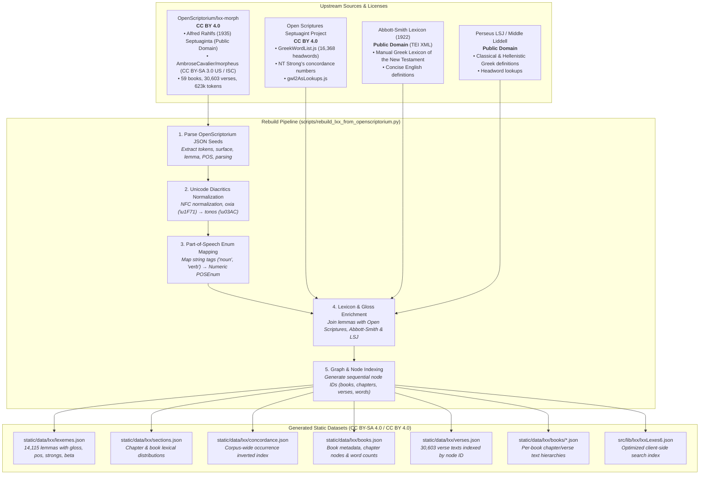

# Biblical Lexeme Explorer: Biblical Vocabulary Web Tool 2.0

An interactive, high-performance static web application for exploring and analyzing vocabulary across the Septuagint (LXX), Hebrew Bible (BHS), and Greek New Testament (SBLGNT), complete with offline LSJ dictionary lookup, frequency analysis, concordance searches, and customizable word clouds.

---

## Data Provenance & Licensing

All data assets in this repository are derived from unencumbered, openly licensed datasets and public domain resources. For the LXX, this project uses the new [OpenScriptorium/lxx-morph](https://github.com/OpenScriptorium/lxx-morph) dataset rather than the commonly used  CCAT/CATSS-derived morphological data (which is under a strict license). Thus, this project, unlike many others, can be freely shared, modified, and published under open-source licenses.

### Provenance Architecture & Flow



---

## Attributions & Upstream Credits

- **LXX Text & Morphology**:
  - [OpenScriptorium/lxx-morph](https://github.com/OpenScriptorium/lxx-morph) (Licensed under [CC BY 4.0](https://creativecommons.org/licenses/by/4.0/)).
  - Base text: Alfred Rahlfs, *Septuaginta* (1935), Public Domain.
  - Morphological engine: Modernization of Perseus Morpheus ([AmbroseCavalier/morpheus](https://github.com/AmbroseCavalier/morpheus)), CC BY-SA 3.0 US / ISC.
- **English Glosses & Concordance References**:
  - [Open Scriptures Septuagint Project](https://github.com/openscriptures/GreekResources) (Licensed under [CC BY 4.0](https://creativecommons.org/licenses/by/4.0/)).
  - G. Abbott-Smith, *A Manual Greek Lexicon of the New Testament* (1922), Public Domain (TEI XML by [translatable-exegetical-tools/Abbott-Smith](https://github.com/translatable-exegetical-tools/Abbott-Smith)).
- **Greek Lexicon / Dictionary**:
  - Liddell, Scott, Jones (LSJ) *A Greek-English Lexicon* & *Middle Liddell*, Public Domain (via Perseus Tufts & Logeion CEX).
- **Hebrew Bible (BHS)**:
  - ETCBC / Text-Fabric BHS morphological dataset.
- **Greek New Testament (SBLGNT)**:
  - SBL Greek New Testament & MorphGNT (CC BY 4.0).

---

## Licensing Terms

This project utilizes a dual-licensing structure to clearly separate application software from data assets:

- **Application Software**: Licensed under the [GNU Affero General Public License v3.0 (AGPL-3.0)](LICENSE). Covers all source code, SvelteKit components, engines, build scripts, and test suites.
- **Data Assets & Transformations**: Licensed under the [Creative Commons Attribution-ShareAlike 4.0 International License (CC BY-SA 4.0)](LICENSE-DATA). Covers all generated JSON datasets, lexeme indexes, dictionaries, and concordance mappings.

For complete details on license scope, third-party code, and upstream data provenance, see [LICENSES.md](LICENSES.md).

---

## Rebuilding the Dataset

To re-extract and rebuild the static dataset files from source seeds:

```bash
python3 scripts/rebuild_lxx_from_openscriptorium.py
```

This updates all JSON files under `static/data/lxx/` and updates the search index at `src/lib/lxx/lxxLexes6.json`.

---

## Development & Testing

```bash
# Install dependencies
npm install

# Run unit & integration tests
npm test

# Run development server
npm run dev

# Build production bundle
npm run build

# Preview production build locally
npm run preview
```
